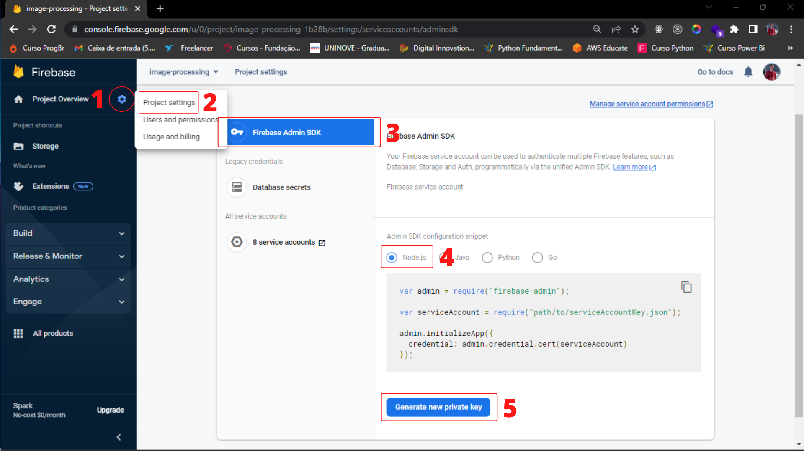

<h1 align="center" name="readme-top"> Sistema de upload de imagens </h1>

  

  
Índice

  <ol>
    <li><a href="#descrição-do-projeto">Descrição do Projeto</a></li>
    <li><a href="#tutorial-de-instalacao-em-sua-maquina-local">Tutorial de instalação em sua máquina local
tutorial-de-instalacao-em-sua-maquina-local</a></li>
    <li><a href="#acesso-ao-projeto">Acesso ao Projeto</a></li>
    <li><a href="#tecnologias-utilizadas">Tecnologias utilizadas</a></li>
    <li><a href="#pessoas-desenvolvedoras">Pessoas Desenvolvedoras do Projeto</a></li>
    <li><a href="#licença">Licença</a></li>
  </ol>

# 
 Descrição do Projeto 

 Sistema de upload de imagens para banco de dados em nuvem. 

# 
 :hammer: Funcionalidades do projeto 

    <a href="#acesso-ao-projeto">Este sistema está disponível online</a>

 

* Tutorial de utilização do sistema

 
   

1. Primeiro crie sua conta no <a href="https://firebase.google.com/" target="_blank">firebase</a> e crie um storage.
2. Siga os passos de 1 à 5 para baixar sua key do firebase admin.
3. Renomeie o arquivo para `firebase-key.json` e insira-o na pasta `firebase`. 
4. No seu terminal inicie o código `yarn` ou `npm install` para instalar as dependências do projeto e gerar o arquivo de produração otimizado.
5. Se necessário instale o <a href="https://www.mongodb.com/try/download/community" target="_blank">MongoDB</a>.

* Para desenvolvimento inicie com yarn dev
* Para uso inicie no terminal `yarn start` ou `npm start`

    <strong> Necessário possuir <a href="https://nodejs.org/en/" target="_blank">Node.js</a> em sua máquina </strong>

 

(<a href="#readme-top">Voltar ao topo</a>)

# 
 :file_folder: Acesso ao Projeto 

Você pode acessar o projeto clicando <strong>[aqui.](https://firebase-storage-test.onrender.com/)</strong>

(<a href="#readme-top">Voltar ao topo</a>)

# 
 :heavy_check_mark: Tecnologias Utilizadas 

* `React.js`
* `Javascript`
* `MongoDB`
* `Firebase`
* `Express.js`
* `Multer`
* `CSS`

(<a href="#readme-top">Voltar ao topo</a>)

# 
 Autor 

[ Mikaelisson Gesuino](https://github.com/Mikaelisson)
| :---: |

(<a href="#readme-top">Voltar ao topo</a>)

# 
 Licença 

The [MIT License]() (MIT)

Copyright :copyright: 2022 - Sistema de upload de imagens para banco de dados em nuvem.